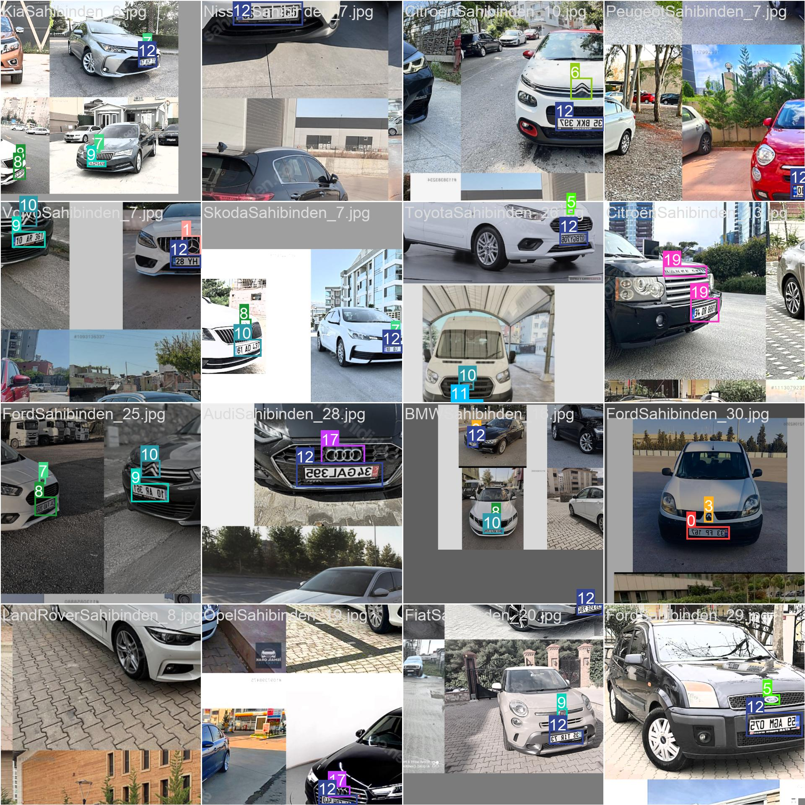

# Turkish Car Detection Project

## Overview

This project is dedicated to the task of detecting cars in both images and videos, employing the powerful YOLO (You Only Look Once) algorithm. The implementation is specifically based on the YOLOv5 model, leveraging its efficiency in real-time object detection. The system is trained using labeled data, allowing for accurate identification and localization of cars in diverse scenarios.

## Motivation

The motivation behind this project stems from the increasing demand for robust and efficient car detection systems in various applications. From traffic management to smart parking solutions, the ability to accurately identify and track vehicles is crucial. YOLO, with its single-shot detection approach, provides a real-time solution, making it well-suited for dynamic environments.
## Key Features

- Efficient car detection using YOLOv5
- Customizable and easy-to-use for various datasets
- Train your own model for specific car classes
- Real-time detection in videos and live streams

